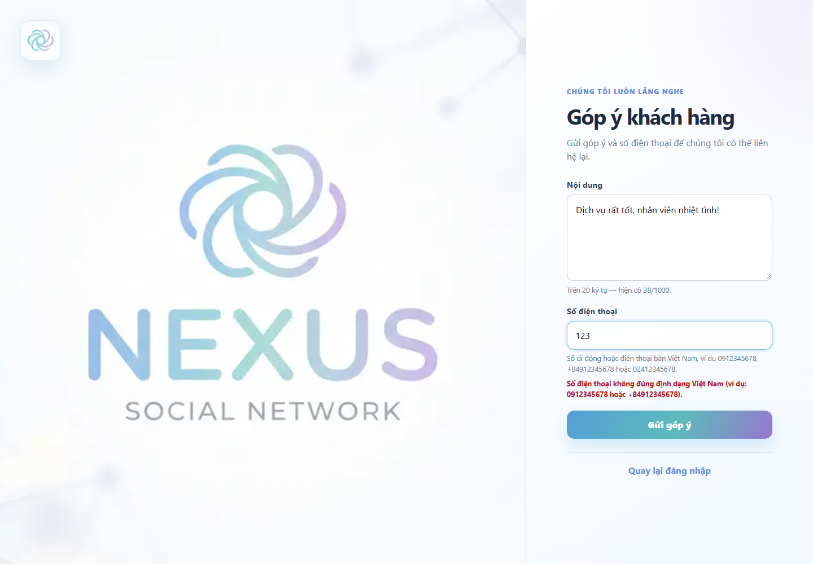

# Form "Góp ý khách hàng" với Zod và Server Actions

Bài làm xây dựng form **Góp ý khách hàng** trên nền ứng dụng **Nexus Social Network** (Next.js App Router, TypeScript, PostgreSQL). Dữ liệu nhập vào được kiểm tra bằng **Zod** ở cả client và server.

## 1. Đề bài

- **Nhiệm vụ:** Mỗi nhóm tạo một form "Góp ý khách hàng".
- **Yêu cầu:** Dùng Zod để kiểm tra dữ liệu:
  - Trường **"Nội dung"** phải trên 20 ký tự.
  - Trường **"Số điện thoại"** phải đúng định dạng số điện thoại Việt Nam.
- **Tiêu chí chấm điểm:** Nhập dữ liệu sai để kiểm tra các thông báo validation, gồm nội dung không vượt quá 20 ký tự và số điện thoại không đúng định dạng Việt Nam; trình bày kết quả kiểm tra và thông báo lỗi trên form.

## 2. Kết quả đạt được

| Yêu cầu | Cách thực hiện | Trạng thái |
|---|---|---|
| Form "Góp ý khách hàng" | Trang `/feedback`, có link từ trang đăng nhập | Hoàn thành |
| Dùng Zod | `feedbackSchema` trong `lib/validations/feedback.ts` | Hoàn thành |
| "Nội dung" trên 20 ký tự | Tối thiểu 21 ký tự, báo lỗi nếu ngắn hơn | Hoàn thành |
| "Số điện thoại" đúng định dạng VN | Regex số di động và cố định Việt Nam, có chuẩn hóa dữ liệu nhập | Hoàn thành |
| Hiển thị thông báo lỗi trên form | Lỗi hiện ngay dưới từng ô nhập | Hoàn thành |
| Validate phía server | Server Action gọi lại `safeParse` | Hoàn thành |

## 3. Quy tắc validation

### Trường "Nội dung"

- Không được để trống (khoảng trắng đầu/cuối bị bỏ trước khi kiểm tra).
- Phải **trên 20 ký tự** (tối thiểu 21). Nhập đúng 20 ký tự vẫn bị báo lỗi.
- Tối đa 1000 ký tự.
- Văn bản được chuẩn hóa Unicode (NFC), bỏ khoảng trắng đầu/cuối và đếm theo cụm ký tự hiển thị (*grapheme*) bằng `Intl.Segmenter`. Chữ có dấu, emoji màu da (`👍🏽`), cờ (`🇻🇳`) và emoji gia đình (`👨‍👩‍👧‍👦`) mỗi cụm được tính là 1 ký tự; bộ đếm và schema dùng cùng quy tắc.

### Trường "Số điện thoại"

- Không được để trống.
- Nhận số **di động và cố định** Việt Nam, dùng đầu `0`, `84` hoặc `+84`. Dạng quốc tế bỏ số `0` đầu.
- Số di động có 10 chữ số ở dạng trong nước, kiểm tra các đầu số trong regex của schema.
- Số cố định có 11 chữ số ở dạng trong nước: `024`/`028` + 8 chữ số, hoặc mã vùng tỉnh 4 chữ số gồm `0` đầu + 7 chữ số thuê bao. Ví dụ: `02412345678`, `02031234567`, `+842412345678`.
- Cho phép nhập có dấu cách, dấu chấm hoặc gạch ngang, ví dụ `0912 345 678`. Schema chuẩn hóa về `0912345678` trước khi Server Action nhận dữ liệu.
- Danh sách mã vùng cố định tham chiếu [thông cáo của Bộ Khoa học và Công nghệ](https://mst.gov.vn/thong-cao-bao-chi-ve-viec-thuc-hien-quy-hoach-ma-vung-dien-thoai-co-dinh-mat-dat-ke-tu-01-7-2025-197250704101929995.htm), gồm các mã vùng được sử dụng song song sau sắp xếp tỉnh. Validation kiểm tra định dạng, không xác minh thuê bao đang hoạt động.

Regex sử dụng (áp dụng sau khi bỏ dấu cách, dấu chấm, gạch ngang; danh sách `landlineAreaCodes` nằm trong `lib/validations/feedback.ts`):

```ts
new RegExp(
  `^(?:0|\\+?84)(?:(?:3[2-9]|5[25689]|7[06-9]|8[1-9]|9[0-46-9])\\d{7}|(?:24|28)\\d{8}|(?:${landlineAreaCodes})\\d{7})$`,
)
```

### Thông báo lỗi

| Trường | Tình huống | Thông báo hiển thị |
|---|---|---|
| Nội dung | Để trống hoặc chỉ có khoảng trắng | Vui lòng nhập nội dung góp ý. |
| Nội dung | Từ 1 đến 20 ký tự | Nội dung góp ý phải trên 20 ký tự. |
| Nội dung | Quá 1000 ký tự | Nội dung góp ý không được vượt quá 1000 ký tự. |
| Số điện thoại | Để trống | Vui lòng nhập số điện thoại. |
| Số điện thoại | Sai định dạng | Số điện thoại không đúng định dạng Việt Nam (ví dụ: 0912345678 hoặc +84912345678). |

## 4. Cách hoạt động

Form dùng **cùng một schema Zod** cho hai lớp kiểm tra:

1. **Client:** `react-hook-form` kết hợp `zodResolver(feedbackSchema)`. Form kiểm tra khi người dùng rời khỏi ô hoặc gửi form; sau khi gửi, trường có lỗi được kiểm tra lại khi thay đổi. Form có `noValidate` nên thông báo lỗi đến từ Zod, không phải từ trình duyệt.
2. **Server:** `submitFeedbackAction` nhận `input: unknown` và gọi `feedbackSchema.safeParse(input)`. Không tin dữ liệu từ client vì người dùng có thể bỏ qua giao diện và gọi action trực tiếp. Nếu sai, action trả về `{ status: "error", fieldErrors }`; form gắn lỗi vào đúng ô bằng `setError`.
3. **Lưu dữ liệu:** action gọi `insertFeedback(parsed.data)` và insert nội dung, số điện thoại đã chuẩn hóa vào PostgreSQL bằng query có tham số `$1`, `$2`. Nếu database không kết nối được hoặc chưa có bảng, form báo lỗi và giữ nội dung để thử lại.
4. **Thành công:** chỉ sau khi insert thành công, action trả về `{ status: "success", formSuccess }`, form hiện thông báo thành công và xóa nội dung đã nhập. Lỗi kết nối gửi action cũng được hiển thị trên form.

Dữ liệu góp ý được lưu trong bảng `feedbacks`: `id`, `content`, `phone`, `created_at`. Bảng độc lập với tài khoản nên không cần đăng nhập để gửi góp ý.

## 5. Các file liên quan

| File | Vai trò |
|---|---|
| `lib/validations/feedback.ts` | Schema Zod `feedbackSchema`, regex số điện thoại, hàm chuẩn hóa nội dung và số điện thoại |
| `app/actions/feedback.ts` | Server Action `submitFeedbackAction`, validate lại ở server |
| `lib/data/feedback.ts` | Lưu góp ý bằng parameterized query |
| `sql/feedback.sql` | Tạo bảng góp ý trên database hiện có, có thể chạy lại |
| `scripts/test-feedback.cjs` | Kiểm thử Zod và Server Action, mô phỏng lỗi database |
| `components/forms/FeedbackForm.tsx` | Form dùng react-hook-form, hiển thị lỗi từng ô và bộ đếm ký tự |
| `app/(auth)/feedback/page.tsx` | Trang `/feedback` |
| `app/(auth)/login/page.tsx` | Thêm liên kết "Góp ý khách hàng" |
| `lib/types/forms.ts` | Kiểu `FormActionState` dùng chung cho các Server Action |
| `components/ui/FormAlert.tsx`, `components/ui/SubmitButton.tsx` | Thành phần giao diện dùng lại |

## 6. Hướng dẫn chạy

Yêu cầu: Node.js 20 trở lên, Docker (cho PostgreSQL).

1. Tạo `.env.local` từ `.env.example` và điền cấu hình PostgreSQL.
2. Chạy PostgreSQL: `docker compose --env-file .env.local up -d`.
3. Khởi tạo database bằng `sql/schema.sql` nếu database chưa có bảng (PowerShell):

   ```powershell
   Get-Content -Raw .\sql\schema.sql | docker compose --env-file .env.local exec -T postgres sh -lc 'psql -v ON_ERROR_STOP=1 -U "$POSTGRES_USER" -d "$POSTGRES_DB"'
   ```

   Nếu database đã có các bảng cũ, chỉ chạy migration góp ý, không chạy lại toàn bộ `schema.sql`:

   ```powershell
   Get-Content -Raw .\sql\feedback.sql | docker compose --env-file .env.local exec -T postgres sh -lc 'psql -v ON_ERROR_STOP=1 -U "$POSTGRES_USER" -d "$POSTGRES_DB"'
   ```

4. Cài dependency: `npm ci`.
5. Chạy ứng dụng: `npm run dev`, sau đó mở `http://localhost:3000/feedback`.

Kiểm tra mã nguồn: `npm run test:feedback`, `npm run typecheck`, `npm run lint` và `npm run build`.

> Trang `/feedback` và validation phía client vẫn hiển thị khi chưa cấu hình PostgreSQL. Gửi góp ý hợp lệ cần `DATABASE_URL` và bảng `feedbacks`; thiếu cấu hình thì form báo lỗi lưu dữ liệu, không báo thành công.

## 7. Kết quả kiểm tra

Truy cập `/feedback` và nhập lần lượt các giá trị dưới đây.

### Trường "Nội dung"

| Giá trị nhập | Kết quả |
|---|---|
| *(để trống)* hoặc toàn dấu cách | Lỗi: Vui lòng nhập nội dung góp ý. |
| `Quá ngắn` | Lỗi: Nội dung góp ý phải trên 20 ký tự. |
| `aaaaaaaaaaaaaaaaaaaa` (đúng 20 ký tự) | Lỗi: Nội dung góp ý phải trên 20 ký tự. |
| `aaaaaaaaaaaaaaaaaaaaa` (21 ký tự) | Hợp lệ |
| `👍🏽` hoặc `👨‍👩‍👧‍👦` lặp 20 lần | Lỗi: Nội dung góp ý phải trên 20 ký tự. |
| `👍🏽` hoặc `👨‍👩‍👧‍👦` lặp 21 lần | Hợp lệ, bộ đếm hiển thị 21 |
| `Dịch vụ rất tốt, nhân viên nhiệt tình!` | Hợp lệ |

### Trường "Số điện thoại"

| Giá trị nhập | Kết quả |
|---|---|
| *(để trống)* | Lỗi: Vui lòng nhập số điện thoại. |
| `123` | Lỗi: sai định dạng |
| `091234567` (thiếu số) | Lỗi: sai định dạng |
| `09123456789` (thừa số) | Lỗi: sai định dạng |
| `0112345678` (đầu số không tồn tại) | Lỗi: sai định dạng |
| `+840912345678` (thừa số 0 sau +84) | Lỗi: sai định dạng |
| `0912abc678` | Lỗi: sai định dạng |
| `0912345678` | Hợp lệ |
| `091 234 5678`, `0912.345.678`, `0912-345-678` | Hợp lệ (chuẩn hóa về `0912345678`) |
| `+84912345678`, `84912345678` | Hợp lệ |
| `02412345678`, `02812345678`, `02031234567` | Hợp lệ (số cố định) |
| `+842412345678`, `842812345678`, `+842031234567` | Hợp lệ (số cố định dạng quốc tế) |
| `0241234567`, `024123456789`, `02001234567` | Lỗi: thiếu/thừa số hoặc mã vùng không hợp lệ |

### Hình ảnh minh họa

Ảnh chụp từ ứng dụng chạy thực tế:





### Kiểm thử tự động

`npm run test:feedback` chạy 48 kiểm tra với schema Zod thật: nội dung rỗng, mốc 20/21 và 1000/1001 ký tự, Unicode/emoji ghép, số di động/cố định trong nước và quốc tế, lỗi từng trường và validation lại tại Server Action. Bộ test mô phỏng tầng database để xác nhận chỉ lưu dữ liệu hợp lệ, chuẩn hóa dữ liệu trước khi lưu và không báo thành công khi insert thất bại.

Ngày 08/10/2026: 48 kiểm tra, typecheck, lint và build đều qua. Đã kiểm tra form production trên Edge, đọc lại bản ghi sau khi gửi và thử lỗi database bằng PostgreSQL/WASM (PGlite). Xem [báo cáo kiểm tra và giới hạn môi trường](docs/KIEM_TRA.md).

## 8. Cấu trúc dự án

```text
├── app/
│   ├── (auth)/              # Đăng nhập, đăng ký, góp ý khách hàng và layout xác thực
│   ├── actions/             # Server Actions: auth, posts, feedback
│   ├── feed/                # Trang feed được bảo vệ bởi session
│   ├── globals.css          # Style dùng chung
│   ├── layout.tsx           # Root layout
│   └── page.tsx             # Chuyển / sang /login
├── components/
│   ├── feed/                # Header, danh sách và thẻ bài viết
│   ├── forms/               # Form đăng ký, đăng nhập, góp ý, đăng/xóa bài, đăng xuất
│   └── ui/                  # Nút submit và thông báo dùng lại
├── lib/
│   ├── auth/                # Hash mật khẩu và quản lý session
│   ├── data/                # Query users, sessions và posts
│   ├── demo/                # Cờ bật/tắt demo SQL injection local
│   ├── server/              # Kết nối PostgreSQL
│   ├── types/               # Kiểu dữ liệu dùng chung
│   └── validations/         # Schema Zod: auth, post, feedback
├── public/                  # icon.png và background.png
├── sql/schema.sql           # Schema PostgreSQL
├── scripts/                 # Script tạo dữ liệu demo
├── docker-compose.yml       # PostgreSQL local
└── .env.example             # Mẫu biến môi trường
```

Các route:

| Route | Chức năng |
|---|---|
| `/` | Chuyển hướng sang `/login` |
| `/register` | Đăng ký tài khoản |
| `/login` | Đăng nhập và tạo session |
| `/feedback` | Form "Góp ý khách hàng" (không cần đăng nhập) |
| `/feed` | Xem feed, đăng bài, xóa bài của mình và đăng xuất |


## Phụ lục: Demo SQL injection ở trang đăng nhập (tùy chọn, chỉ chạy local)

Phần này thuộc dự án nền, không liên quan đến form góp ý. Mặc định `ENABLE_UNSAFE_LOGIN_SQL_DEMO` trong `lib/demo/security.ts` là `false`: đăng nhập dùng parameterized query và bcrypt.

Để demo, chạy `node --env-file=.env.local scripts/setup-login-demo.cjs`, đổi cờ thành `true`, rồi chạy `npm run dev`. Script tạo bảng tài khoản giả và hai hồ sơ `sql_demo_a`, `sql_demo_b`.

- Demo 1: email `demo_a@example.com`, mật khẩu `' OR email = 'demo_a@example.com' --`.
- Demo 2: email `khongtontai@example.com`, mật khẩu `' OR 1=1 --`.

Đăng xuất giữa các lần thử. Sau demo, **đổi cờ về `false`**; đổi cờ không tự xóa session hiện có. Action demo bị vô hiệu hóa khi chạy production.
